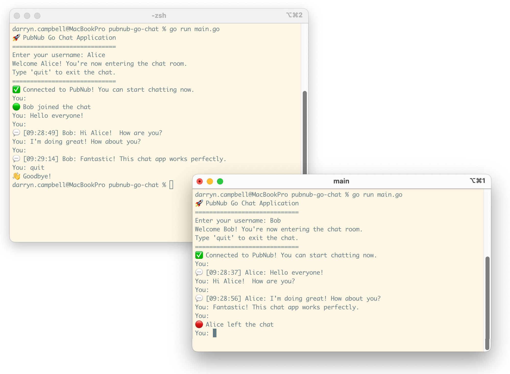

# PubNub Go Chat Application

A simple real-time chat application built with Go and PubNub that allows multiple clients to exchange messages instantly.



## Resources

- [PubNub Go SDK](https://github.com/pubnub/go)
- [PubNub Go SDK documentation](https://www.pubnub.com/docs/sdks/go)

## Features

- ✅ Real-time messaging between multiple clients
- ✅ User presence notifications (join/leave events)
- ✅ Simple command-line interface
- ✅ Message timestamps
- ✅ Built entirely with Go and PubNub SDK

## Prerequisites

- Go 1.21 or later
- PubNub account and Publish / Subscribe keys

## Setup to build the sample

### 1. Clone the sample app

```bash
git clone https://github.com/PubNubDevelopers/pubnub-go-chat.git
cd pubnub-go-chat
```

### 2. Get PubNub Keys

1. Sign up for a free PubNub account at [https://admin.pubnub.com](https://admin.pubnub.com)
2. Create a new app in the PubNub Admin Portal
3. Enable Presence Events on the keyset
4. Copy the Publish and Subscribe keys from the app's keyset


### 3. Configure the Application

Edit the constants in `main.go` to define your PubNub keys.  You don't need to change the CHAT_CHANNEL value.

```go
const (
  PUBLISH_KEY   = "Change me: your-publish-key-here"
  SUBSCRIBE_KEY = "Change me: your-subscribe-key-here"
  CHAT_CHANNEL  = "chat-room"
)
```

### 4. Install Dependencies

```bash
go mod tidy
```

## Running the Sample Application

To test the chat functionality between two clients, open two terminal windows:

**Terminal 1:**
```bash
go run main.go
```

**Terminal 2:**
```bash
go run main.go
```

Enter different usernames in each terminal and start chatting!

## Usage

1. When you start the application, you'll be prompted to enter a username
2. Once connected, you can start typing messages
3. Messages from other users will appear in real-time
4. You'll see presence notifications when users join or leave the chat.  This is powered by PubNub presence
5. Type `quit` or `exit` to leave the chat

## Example Session

```
🚀 PubNub Go Chat Application
=============================
Enter your username: Alice
Welcome Alice! You're now entering the chat room.
Type 'quit' to exit the chat.
=============================
✅ Connected to PubNub! You can start chatting now.

🟢 Bob joined the chat
You: Hello everyone!

💬 [14:32:15] Bob: Hi Alice! How are you?
You: I'm doing great! How about you?

💬 [14:32:30] Bob: Fantastic! This chat app works perfectly.
You: quit
👋 Goodbye!
```

## Architecture / PubNub Features Used

The application uses the following PubNub features:

- **Publish/Subscribe**: Core messaging functionality
- **Presence**: Tracks when users join/leave the chat
- **Real-time Events**: Handles incoming messages and status updates through PubNub channels

## Key Components

- **PubNub Configuration**: Sets up the client with your API keys
- **Event Listener**: Handles incoming messages, presence events, and connection status
- **Message Publishing**: Sends chat messages to the PubNub channel
- **Presence Monitoring**: Shows when users join or leave the chat room

## Customization

You can customize the application by:

- Changing the `CHAT_CHANNEL` constant to use different chat rooms
- Modifying the `ChatMessage` struct to include additional fields
- Adding command parsing for special chat commands (similar to how the current app handles `quit` and `exit`)
- Add support for [message history](https://www.pubnub.com/docs/sdks/go/api-reference/storage-and-playback)

## Troubleshooting

### Connection Issues
- Verify your internet connection
- Check that your PubNub keys are correct
- Ensure you're not behind a firewall blocking PubNub connections

### Presence Messages not showing
- Check you have presence enabled on your keyset
- Check presence is enabled on your channel (see [presence management](https://www.pubnub.com/docs/bizops-workspace/presence-management) in the portal)

### Messages Not Appearing
- Make sure both clients are subscribed to the same channel
- Check for any error messages in the console
- Verify the publish operation is successful

### Build Errors
- Ensure Go version 1.21 or later is installed
- Run `go mod tidy` to resolve dependencies
- Check that all imports are correct

## Get in touch with us

Contact the PubNub devrel team at [devrel@pubnub.com](mailto:devrel@pubnub.com) if you have any other questions, issues or comments.

## License

This project is open source and available under the MIT License. 